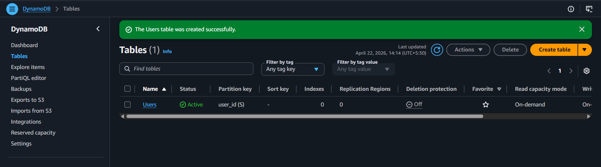
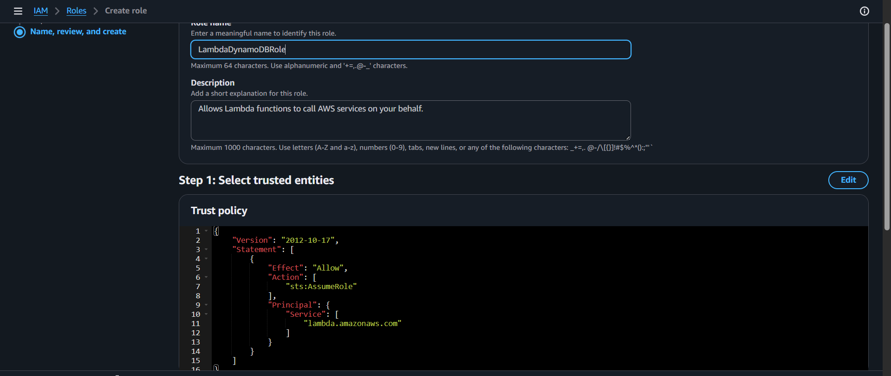
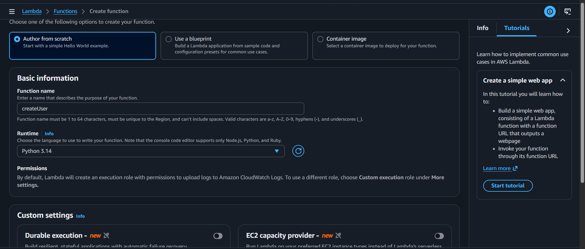
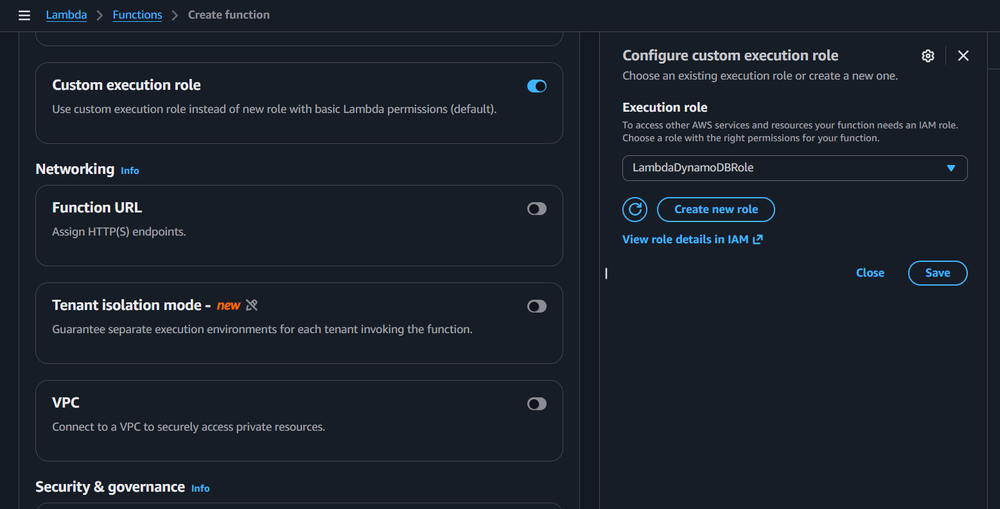

# Serverless CRUD API using AWS Lambda, API Gateway, DynamoDB


## 📌 Project Overview
This project is a **simple REST API** built using AWS serverless services.  
It allows you to **Create, Read, Update, and Delete (CRUD)** user data.

No servers are managed manually — everything runs on AWS.

---

## How It Works (Simple Explanation)

1. User sends request (Postman)
2. API Gateway receives request
3. Lambda function runs Python code
4. DynamoDB stores/retrieves data
5. Response is sent back

---

## Architecture

Client → API Gateway → Lambda → DynamoDB

---

## Technologies Used

- AWS Lambda (Python)
- API Gateway
- DynamoDB
- IAM (for permissions)
- Postman (for testing)

---

## Features

- ➕ Create user  
- 📖 Get all users  
- 🔍 Get single user  
- ✏️ Update user  
- ❌ Delete user  

---

## API Endpoints

| Method | Endpoint | Description |
|--------|---------|------------|
| POST | /users | Create user |
| GET | /users | Get all users |
| GET | /users/{id} | Get one user |
| PUT | /users/{id} | Update user |
| DELETE | /users/{id} | Delete user |

---

# Step-by-Step Setup (Beginner Friendly)

## 1️⃣ Create DynamoDB Table

- Go to AWS → DynamoDB  
- Click **Create Table**  
- Table name: `Users`  
- Partition key: `user_id` (String)  
- Click Create  



---

## 2️⃣ Create IAM Role

- Go to IAM → Roles → Create Role  
- Select **Lambda**  
- Attach policy: `AmazonDynamoDBFullAccess`  
- Name: `LambdaDynamoDBRole`



---

## 3️⃣ Create Lambda Function

- Go to AWS Lambda  
- Click **Create Function**  
- Name: `createUser`  
- Runtime: Python  

- Select Custom execution role and IAM role created above 


---

## 4️⃣ Add Lambda Code

Paste this code:

```python
import json
import boto3
import uuid

dynamodb = boto3.resource('dynamodb')
table = dynamodb.Table('Users')

def lambda_handler(event, context):
    try:
        http_method = event['httpMethod']
        path_params = event.get('pathParameters')
        body = json.loads(event.get('body') or '{}')

        # CREATE USER
        if http_method == 'POST':
            user_id = str(uuid.uuid4())

            item = {
                'user_id': user_id,
                'name': body.get('name', ''),
                'email': body.get('email', '')
            }

            table.put_item(Item=item)

            return response(200, {'message': 'User created', 'user_id': user_id})

        # GET ALL USERS
        elif http_method == 'GET' and not path_params:
            result = table.scan()
            return response(200, result.get('Items', []))

        # GET SINGLE USER
        elif http_method == 'GET' and path_params:
            user_id = path_params['id']
            result = table.get_item(Key={'user_id': user_id})
            return response(200, result.get('Item', {}))

        # UPDATE USER
        elif http_method == 'PUT':
            user_id = path_params['id']

            table.update_item(
                Key={'user_id': user_id},
                UpdateExpression="set #n=:n, email=:e",
                ExpressionAttributeNames={'#n': 'name'},
                ExpressionAttributeValues={
                    ':n': body.get('name', ''),
                    ':e': body.get('email', '')
                }
            )

            return response(200, {'message': 'User updated'})

        # DELETE USER
        elif http_method == 'DELETE':
            user_id = path_params['id']

            table.delete_item(Key={'user_id': user_id})

            return response(200, {'message': 'User deleted'})

        else:
            return response(400, {'message': 'Invalid request'})

    except Exception as e:
        return response(500, {'error': str(e)})


def response(status, body):
    return {
        'statusCode': status,
        'headers': {
            'Content-Type': 'application/json'
        },
        'body': json.dumps(body)
    }

```

## 5️⃣ Create API Gateway

- Go to AWS Console → API Gateway  
- Click **Create API** → Select **REST API**  
- Click **Build**  

### ➤ Create Resource
- Click **Create Resource**
- Resource name: `users`
- Resource path: `/users`

### ➤ Add Methods to `/users`
- Add **POST** method  
- Add **GET** method  

---

## 6️⃣ Create Dynamic Resource `{id}`

- Click on `/users`
- Click **Create Resource**
- Resource name: `{id}` (important: include curly brackets)

This will create:
```
/users/{id}
```


### ➤ Add Methods to `/users/{id}`
- Add **GET** method  
- Add **PUT** method  
- Add **DELETE** method  

---

## 7️⃣ Connect Lambda Function

For each method:

- Integration type: **Lambda**
- Select your Lambda function (`createUser`)
- Enable **Lambda Proxy Integration**
- Click **Save**
- Click **Allow** when prompted

---

## 8️⃣ Deploy API

- Click **Deploy API**
- Create new stage:
  - Stage name: `dev`
- Click **Deploy**

### ➤ API URL Format:
```
https://<api-id>.execute-api.<region>.amazonaws.com/dev
```


---

## 🧪 Testing Using Postman

### ➤ 1. Create User (POST)

**Method:** POST  
```
/dev/users
```

**Body:**
```json
{
  "name": "Prutha",
  "email": "prutha@gmail.com"
}
```

### ➤ 2. Get All Users (GET)

**Method:** GET  

```
/dev/users
```


---

### ➤ 3. Get Single User (GET)

**Method:** GET  
```
/dev/users/{id}
```


Replace `{id}` with actual `user_id`

---

### ➤ 4. Update User (PUT)

**Method:** PUT  
```
/dev/users/{id}
```

**Body:**
```json
{
  "name": "Updated Name",
  "email": "updated@gmail.com"
}
```

### ➤ 5. Delete User (DELETE)

**Method:** DELETE
```
/dev/users/{id}
```

## Learning Outcome
- Learned AWS serverless architecture
- Built REST API from scratch
- Connected multiple AWS services
- Tested APIs using Postman